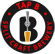

<div align="center">
  <a href="https://github.com/furiousdom/tapper">
    
  </a>
  <h1>Tapper</h1>
  <p><i>Web application for product order management.</i></p>
</div>

<div align="center">
  <a href="https://github.com/furiousdom/tapper/stargazers">
    
  </a>
  <a href="https://github.com/furiousdom/tapper/network/members">
    
  </a>
  <a href="https://github.com/furiousdom/tapper/graphs/contributors">
    
  </a>
  <a href="https://github.com/furiousdom/tapper/pulls">
    
  </a>
  <a href="https://github.com/furiousdom/tapper/issues">
    
  </a>
  <a href="https://github.com/furiousdom/tapper/blob/master/LICENSE">
    
  </a>
</div>

<br />

<div align="center">
  <p>
    <!-- TODO: ONCE LIVE POST THE URL HERE -->
    <!-- <a href="https://github.com/furiousdom/tapper">View Demo</a> -->
    <!-- · -->
    <a href="https://github.com/furiousdom/tapper/issues">Report Bug</a>
    ·
    <a href="https://github.com/furiousdom/tapper/issues">Request Feature</a>
  </p>
</div>


## About The Project

A product order management system for Tap B brewery. Still in development :construction:


### Built With

* [Node.js](https://nodejs.org/)
* [PostgreSQL](https://www.postgresql.org/)
* [Suquelize](https://sequelize.org/)
* [Vue.js](https://vuejs.org/)
* [Vuetify](https://vuetifyjs.com/en/)


## Getting Started

To get a local copy up and running follow these simple steps.


### Prerequisites

Before you begin, ensure you have met the following requirements:
* You have a **Windows 10** machine. It may work on both **Linux and macOS** but they are not supported.
* You have installed [Git for Windows](https://git-scm.com/)
* You have installed [Node.js](https://nodejs.org/) (version `>=12.14.1`)
* You have installed [PostgreSQL](https://www.postgresql.org/) (version `>=13.1`)


### Installation

1. Clone the repo
   ```
   git clone https://github.com/furiousdom/tapper.git
   ```
2. Move to project directory
   ```
   cd tapper
   ```
3. Install all dependencies
   ```
   npm install
   ```


### Usage

1. Start the server
   ```
   npm run dev:server
   ```
2. Start the client
   ```
   npm run dev:client
   ```


## Roadmap

For a list of proposed features (and known issues) see the [open issues](https://github.com/furiousdom/tapper/issues).


## Contributing

Contributions are what make the open source community such an amazing place to be, learn, inspire, and create. Any contributions are **greatly appreciated**.

To contribute to Tapper please create a pull request.
You can see the GitHub documentation on [creating a pull request](https://help.github.com/en/github/collaborating-with-issues-and-pull-requests/creating-a-pull-request).


## Acknowledgements

* [@lukasaric](https://github.com/lukasaric) for code review and advisement


## Contact

Dominik Tabak - <tabakdominik@gmail.com>


## License

Distributed under the [MIT](https://opensource.org/licenses/MIT) License. See `LICENSE` for more information.
